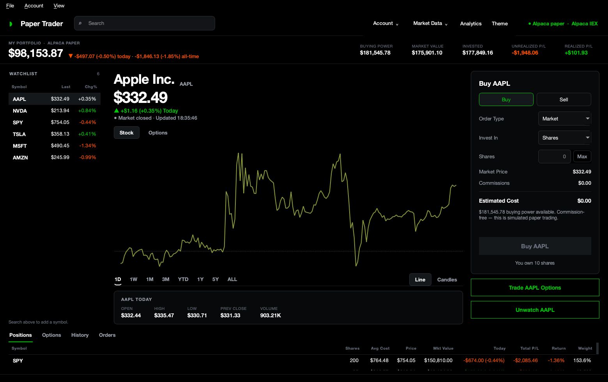
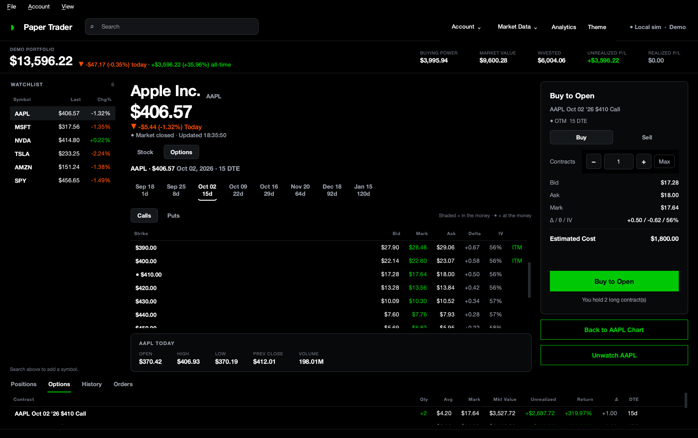
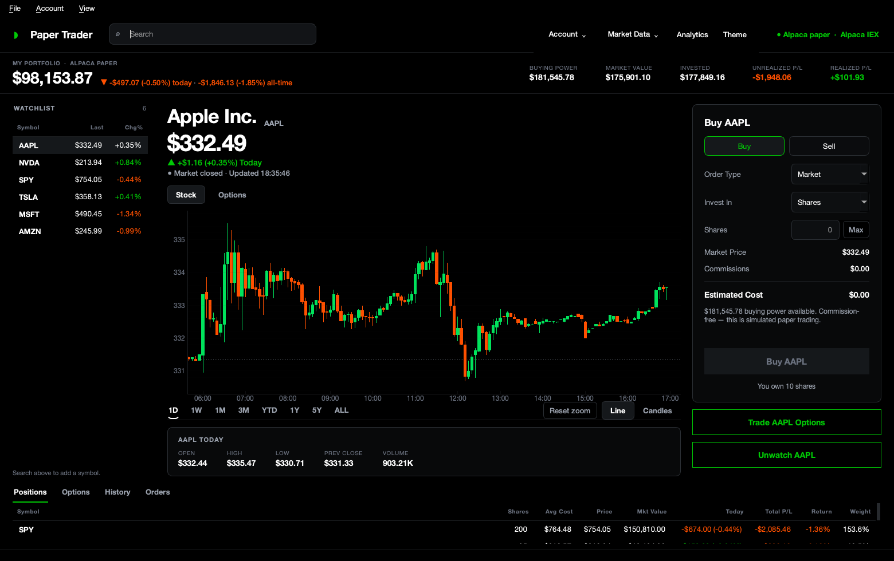
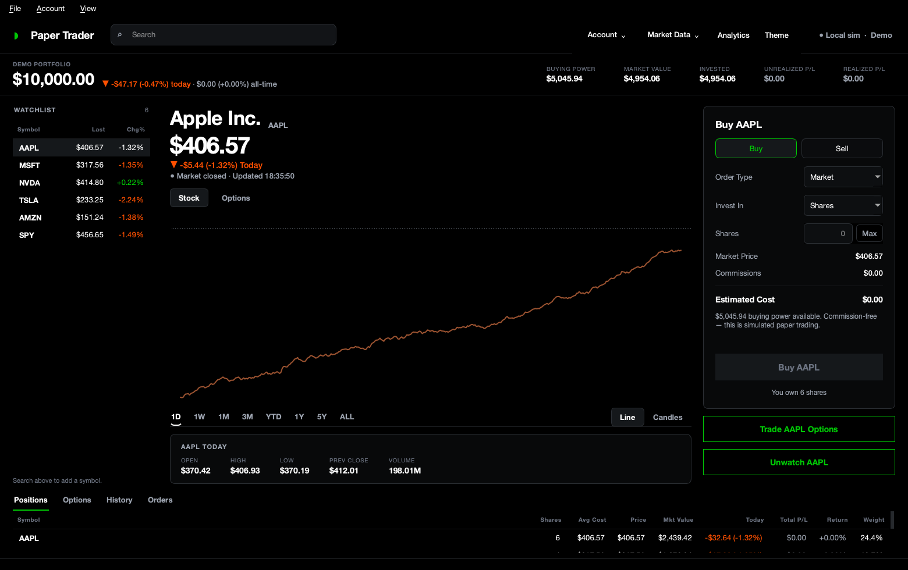

# Paper Trader

A local, real-time **paper-trading desktop app** with a pure-black, Robinhood-style
GUI — including an **animated** interface (rolling numbers, green/red price flashes,
a chart line that draws itself in) and **options trading** on the built-in
simulator. Trade stocks on a **real Alpaca paper account** (server-side orders,
positions and P&L) or the offline simulator, trade **single-leg call/put options**
(long *and* short) priced with Black-Scholes, watch live prices and intraday/
historical charts, and place market & limit orders with fractional shares.
Everything runs on your machine; the only outbound traffic is to the market-data /
Alpaca APIs.



<p align="center"><em>Options mode — a live Black-Scholes chain, the order ticket with Greeks, and open option positions:</em></p>



<p align="center"><em>Candlestick view (Alpaca) and the offline simulator with positions:</em></p>

<p align="center">
  
  
</p>

---

## Highlights

- **Real Alpaca paper trading** — market & limit orders route to your Alpaca paper
  account over REST; account, positions, orders and fills come straight from
  Alpaca and show up in your Alpaca dashboard too.
- **Extended-hours trading** — opt into **pre-market (4:00–9:30 ET)** and
  **after-hours (4:00–8:00 ET)** sessions on the Alpaca account: an
  *Extended-hours order* checkbox on limit orders submits them as Alpaca
  `extended_hours` day limits, and the header shows the live **Pre-Market /
  After Hours** session.
- **Options trading (local simulator)** — a live, synthesized **options chain**
  (expirations + strike ladder) priced with **Black-Scholes** off the underlying's
  spot, so it works with any data source and **no options feed**. Buy/write
  single-leg **calls & puts** (long *and* short), see bid/mark/ask and the Greeks,
  cash-secured collateral for shorts, and automatic **exercise/assignment** at
  expiry.
- **Animated, Robinhood-grade UI** — portfolio value and stat tiles **roll** to
  their new figures, the live price **flashes** green/red on a tick, the chart line
  **draws itself in** left-to-right on symbol/range changes, and views cross-fade.
- **Pluggable backends** — a clean `Broker` abstraction means the same UI drives
  either **Alpaca** (live paper account) or a **local simulator** (offline), and
  market data comes from **Alpaca (IEX)**, **Yahoo Finance**, or **synthetic demo**.
- **Rate-limit aware** — a shared sliding-window limiter keeps *all* Alpaca calls
  (data feed + account poll + orders) under the account's ~200/min cap; batched
  snapshots and cached quotes keep steady-state around ~70/min.
- **Robinhood-quality GUI** (PyQt6 + pyqtgraph): a top nav with instant symbol
  search, the price hero, a full-height **line and candlestick** chart with a
  crosshair, the Buy/Sell order card, and positions / history / open-orders tables.
  Dark **and** light themes.
- **A chart that zooms like a trading terminal** — the wheel zooms the time axis
  and the price axis refits itself to whatever is on screen, so zooming in
  magnifies the candles instead of squashing them into a flat band. The line view
  is chrome-free (no axes, just the price, a dotted previous-close reference and
  the crosshair); the candle view turns the price/time scales back on.
- **Never blocks on the network** — market data and the account poll run on their
  own threads, and orders against a remote broker are dispatched to a worker while
  the ticket shows *Submitting…*, so an eight-second HTTP timeout can't freeze the
  window.
- **Real trading math** — fractional shares, weighted average cost, realized/
  unrealized P&L, buying-power and share validation, simulated limit fills (local).
- **Persistence & analytics** — named sessions saved atomically to disk; total
  return, Sharpe, volatility, max drawdown, win rate, and an equity curve.
- **Strict layer separation** — `data` (network) / `core` (trading logic) /
  `broker` (execution backends) / `ui` (Qt). The core engine imports neither Qt nor
  `requests` and is unit-tested in isolation.

---

## Quick start

Requires **Python 3.10+** (developed on 3.13).

```bash
cd paper_trader

# 1. Create an isolated environment
python3 -m venv .venv
source .venv/bin/activate          # Windows: .venv\Scripts\activate

# 2. Install dependencies
pip install -r requirements.txt

# 3. Run
python run.py                      # uses Alpaca if keys are set, else Yahoo
python run.py --demo               # fully offline: local simulator + synthetic data
```

### Connecting Alpaca (paper trading)

Get free **paper** API keys from [alpaca.markets](https://alpaca.markets) →
*Paper Trading* → *API Keys*, then either:

- launch the app and go to **Account → Alpaca API Keys…**, or
- set environment variables before launching:

  ```bash
  export APCA_API_KEY_ID=PK...
  export APCA_API_SECRET_KEY=...
  python run.py
  ```

Keys are stored locally at `~/.paper_trader/credentials.json` (chmod 600) — never
in the project. When keys are present the app defaults to your live Alpaca paper
account for trading **and** Alpaca (IEX) for market data. Switch backends anytime
from the **Account** and **View → Market Data Source** menus.

> No keys / offline / being rate-limited? `python run.py --demo` always works, or
> pick **View → Market Data Source → Demo** and **Account → Trading Account →
> Local simulator**.

### Run the tests

```bash
python tests/test_engine.py        # trading engine, portfolio, analytics, persistence
python tests/test_options.py       # Black-Scholes, options engine, chain, settlement
python tests/test_data.py          # data cache, synthetic provider, Yahoo parser
python tests/test_ui.py            # chart zoom, empty states, theming, reset (offscreen)
python tests/test_alpaca.py        # live Alpaca provider + broker (skips without keys)
```

---

## Using the app

| Area | What you can do |
|------|-----------------|
| **Top nav** | **Search** any symbol or company name (`⌘F` / `Ctrl+F`); pick a result to chart and watch it. Typing a symbol and pressing Return validates it with the data provider first, so nothing unrecognised ever reaches your watchlist. **Account** switches trading account and holds your API keys, **Market Data** switches provider, plus **Analytics** and **Theme**. The chip on the right shows the live account + data source. |
| **Account strip** | Total value, today's change, all-time return, and buying-power / market-value / invested / unrealized / realized tiles. |
| **Watchlist (left rail)** | Click a row to chart it; right-click to remove. Persists per session. |
| **Centre (Stock / Options)** | A **Stock ⁄ Options** toggle sits above the panel. In **Stock** mode: the big chart — ranges `1D … ALL` under it, **Line / Candles**, hover for a crosshair with the time caption, an OHLC readout and a lit-up price line (the dotted `1D` line is the previous close). **Scroll to zoom the time axis** — the price axis refits the visible bars, so candles genuinely magnify — then **Reset zoom** to go back. In **Options** mode: a live **options chain** — pick an expiration, flip **Calls / Puts**, click a strike (the ladder auto-centres on the money) to load it into the ticket. |
| **Order card (right)** | **Stock:** Buy/Sell, order type, amount in **Shares or Dollars**, **Max**, market price, commissions and estimated cost. **Options:** a card whose label reflects open vs close (*Buy to Open*, *Sell to Close*, …), a contracts stepper, live bid/mark/ask + Δ/θ/IV, estimated cost/credit and the collateral note for shorts. Beneath it: **Trade options** and **Watch / Unwatch** for the active symbol. |
| **Bottom tabs** | **Positions** (stocks), **Options** (each contract's qty, avg premium, mark, value, P&L, Δ, DTE, one-click Close), **History** (every fill incl. options & expirations), **Orders** (resting limit orders with Cancel). |
| **File menu** | New / Open / Rename / Reset / Save session. |
| **Account menu** | Trading account, Alpaca API keys, Analytics (`Ctrl+A`) — Sharpe, volatility, drawdown, win rate, equity curve. |
| **View menu** | Toggle dark/light (`Ctrl+D`); switch the market-data source; focus search. |

**Limit orders** rest until the market crosses your price (buys fill at/under,
sells at/over), then execute at the market price on the next tick — even while you
keep trading other symbols.

**Extended hours** (Alpaca account). Tick **Extended-hours order** on a **limit**
order to trade the pre-market (4:00–9:30 ET) or after-hours (4:00–8:00 ET)
session — it's sent as an Alpaca `extended_hours` day limit (whole shares only;
market orders and fractional shares aren't eligible after hours). The price
header's session chip shows when a pre/after-hours session is live.

**Options** (Local simulator only — switch **Account → Trading Account → Local
simulator**). Each contract is priced with Black-Scholes from the underlying's live
price plus a deterministic implied-vol surface, so the chain re-prices in real time
and needs no options data feed. Market orders fill at the ask (buys) / bid (sells)
for realistic slippage; short positions are **cash-secured** (collateral held out
of buying power); and expired contracts auto-settle — long ITM exercised, short ITM
assigned, everything OTM expires worthless.

Sessions and settings are stored under `~/.paper_trader/` (override with
`PAPER_TRADER_HOME=/some/dir python run.py`).

---

## Architecture

### Layered design

The project is split into four layers with a strict dependency direction. Arrows
show "is allowed to import":

```
        ┌───────────────────────────────────────────────────┐
        │                     ui/  (PyQt6)                   │  presentation only
        │  main_window · widgets · dialogs · theme           │
        │  controllers/data_feed · controllers/broker_feed   │
        └───────┬─────────────────┬──────────────────┬───────┘
                │                 │                  │
        ┌───────▼───────┐  ┌──────▼───────┐   ┌──────▼───────────┐
        │   broker/     │  │    core/     │   │      data/       │  ONLY networked layer
        │ LocalBroker   │  │engine·portfo-│   │ market_data·cache│
        │ AlpacaBroker  │─▶│lio·analytics │   │ alpaca_client    │
        │ (Broker API)  │  │ ·models      │   │ providers·errors │
        └───────┬───────┘  └──────────────┘   └──────────────────┘
                │          pure logic          Alpaca / Yahoo / synthetic
        ┌───────▼───────┐  (no Qt, no net)     providers, rate limiter, cache
        │ persistence/  │
        └───────────────┘
```

- **`core` never imports Qt or `requests`** → the trading engine + valuation are
  tested headlessly and reused by the `LocalBroker`.
- **`data` is the only layer that opens sockets.** Providers implement one
  interface (`MarketDataProvider`); a shared rate limiter throttles Alpaca calls.
- **`broker` abstracts *where trades execute*.** `LocalBroker` wraps the offline
  engine; `AlpacaBroker` calls the Alpaca REST API. Both return the *same* DTOs
  (`PortfolioSnapshot`, `Order`, `Trade`), so widgets don't know or care which is
  active.
- **`ui` touches the network only through two background threads** (market feed,
  broker poll) and the business logic only through the `Broker` object `MainWindow`
  owns.

### File structure

```
paper_trader/
├── run.py                     # launcher (python run.py [--demo] [--home DIR])
├── requirements.txt
├── tests/
│   ├── test_engine.py         # engine, portfolio, analytics, persistence
│   ├── test_options.py        # Black-Scholes, options engine, chain, settlement
│   ├── test_data.py           # cache, synthetic provider, Yahoo parser, batching
│   ├── test_ui.py             # chart zoom, empty states, theming, reset (offscreen)
│   └── test_alpaca.py         # live Alpaca provider + broker (skips without keys)
└── paper_trader/
    ├── config.py              # paths, precision, poll cadence, ranges, rate cap
    ├── util.py                # money/share rounding helpers
    ├── credentials.py         # Alpaca key loading (env or ~/.paper_trader), 0600
    ├── app.py                 # QApplication bootstrap; picks broker + data source
    │
    ├── data/                  # ── DATA LAYER (network) ──
    │   ├── models.py          # Quote, Candle, SearchResult (immutable)
    │   ├── cache.py           # thread-safe TTL cache
    │   ├── alpaca_client.py   # Alpaca REST client + shared sliding-window limiter
    │   ├── market_data.py     # provider interface + Alpaca/Yahoo/Synthetic + service
    │   └── options_chain.py   # synthesized, offline options chain (expiries+strikes)
    │
    ├── core/                  # ── TRADING LOGIC (pure) ──
    │   ├── models.py          # Session, Position, OptionPosition, Trade, Order (+ JSON)
    │   ├── options.py         # OCC contracts, Black-Scholes + Greeks, IV surface
    │   ├── engine.py          # order validation & execution; options + settlement
    │   ├── portfolio.py       # valuation & P&L snapshots (equities + options)
    │   └── analytics.py       # returns, Sharpe, drawdown, trade stats
    │
    ├── broker/                # ── EXECUTION BACKENDS ──
    │   ├── base.py            # Broker interface + shared DTO helpers
    │   ├── local.py           # LocalBroker: the offline simulator
    │   └── alpaca.py          # AlpacaBroker: live paper account over REST
    │
    ├── persistence/           # ── STORAGE ──
    │   └── store.py           # atomic JSON sessions + settings, multi-session
    │
    └── ui/                    # ── PRESENTATION (Qt) ──
        ├── theme.py           # pure-black + light palettes, stylesheet, chart colors
        ├── anim.py            # rolling numbers, price flash, fades (the motion layer)
        ├── format.py          # money/%/share/time formatting
        ├── tables.py          # shared table chrome (header alignment)
        ├── nav_bar.py         # top bar: wordmark, symbol search, account controls
        ├── main_window.py     # composition root: wires everything together
        ├── dialogs.py         # new/open session, analytics, Alpaca API keys
        ├── controllers/
        │   ├── data_feed.py   # QThread worker polling market data
        │   └── broker_feed.py # QThread worker polling the remote broker
        └── widgets/
            ├── portfolio_bar.py   price_header.py   chart.py
            ├── watchlist.py       trade_panel.py
            ├── options_chain.py   option_ticket.py  options_positions.py
            └── positions_table.py history_table.py
```

### Data flow

**Prices in (background → UI).** A `DataFeed` `QObject` lives on its own
`QThread` and ticks on a `QTimer`. Each tick it asks `MarketDataService` for the
active symbol's quote (and periodically its chart and the watchlist). The service
serves from a **TTL cache** or fetches from the provider. Results cross to the GUI
thread as **Qt signals** — so the UI never blocks and updates are serialized onto
the event loop (no flicker, no torn reads).

```
QTimer tick → MarketDataService → (cache | Alpaca/Yahoo/Synthetic provider)
            → quoteReady / chartReady / watchlistQuotesReady  ──signal──▶ MainWindow
            → PriceHeader · ChartWidget · WatchlistPanel · PositionsTable · PortfolioBar
```

**Account state in (remote brokers).** For Alpaca, a second `BrokerFeed` thread
polls `broker.refresh()` (account/positions/orders/fills) and signals `updated`;
MainWindow re-reads `broker.snapshot(prices)` on the GUI thread. Position values
still tick on every *price* update because `snapshot()` overlays live prices on
cached positions with **no** network call.

**Actions out (UI → logic).** Widgets emit intent (an `OrderTicket`, a symbol
selection, a search string). `MainWindow` is the only place that calls the
**broker**, reconfigures the feeds, or persists:

```
TradePanel.orderRequested ─▶ MainWindow ─▶ Broker.buy/sell/limit  (LocalBroker → engine,
                                         │                          AlpacaBroker → REST)
                                         ─▶ Broker.snapshot() ─▶ refresh views
```

For the local simulator, every price tick also runs `broker.on_price_tick(prices)`
so resting **limit orders** fill the moment their trigger is reached (Alpaca does
this server-side).

### Brokers, data sources & rate limiting

- **Trading account** (Account menu): *Alpaca paper* — real orders/positions/P&L
  from your Alpaca account — or *Local simulator* — the offline engine.
- **Market data** (View → Market Data Source): *Alpaca (IEX)*, *Yahoo Finance*, or
  *Demo* (synthetic, no network).
- **Rate limiting.** Alpaca allows ~200 API calls/min per account. A shared,
  thread-safe **sliding-window limiter** (`RateLimiter`, one per API key) throttles
  every Alpaca request — across the data feed, broker poll and order actions — to a
  configurable cap (default 180/min) with headroom. Load is also *reduced*: the
  watchlist is fetched with one multi-symbol snapshot, active quotes are snapshot-
  only (no bars), quotes are TTL-cached, and fills are polled less often than the
  account. Measured steady-state: **~66 calls/min**.

---

## How it was built (incremental order)

The app was built and verified bottom-up, each layer tested before the next:

1. **Data layer** — provider interface, Yahoo JSON client, TTL cache, typed
   errors; verified quote/chart/search parsing and the invalid-symbol path.
2. **Trading core** — `Session`/`Position`/`Trade`/`Order` models, then the
   engine (buy/sell/limit, validation, average cost, realized P&L), portfolio
   valuation and analytics; 25 assertions covering the accounting.
3. **Persistence** — atomic JSON sessions + settings, multi-session listing;
   round-trip verified.
4. **UI shell & theme** — window layout, splitters, dark/light stylesheet.
5. **Widgets** — price header, chart (line + candlestick + crosshair), watchlist,
   order ticket, tables.
6. **Feed thread & wiring** — background polling, signal/slot plumbing, live
   portfolio refresh, limit-order processing.
7. **Polish** — analytics dialog, session management, demo mode, keyboard
   shortcuts; end-to-end tested offscreen (build window → run feed → trade →
   persist) and visually verified.

---

## Design notes

- **Money math.** Prices/quantities are `float` (market data arrives as floats and
  feeds numpy/pyqtgraph directly), but every mutation in the engine is rounded via
  `util.round_money` (cents) / `round_shares` (1e-6). Dollar-sized buys truncate
  shares down so an order can never exceed its budget by a rounding cent.
- **Rate limits.** Alpaca's ~200 calls/min/account is respected by a shared
  sliding-window `RateLimiter` (one per key, so the data feed, broker poll and
  order actions can't collectively exceed it) plus load reduction: batched
  multi-symbol snapshots, snapshot-only active quotes, a TTL cache, and less-
  frequent fill polling. Yahoo's per-IP throttling is handled with backoff and
  cookie/crumb self-healing. Steady-state Alpaca usage is ~66/min.
- **Resilience.** Network/HTTP failures, invalid tickers, missing keys and offline
  states are caught as typed errors, surfaced non-blockingly in the status bar, and
  never crash the app or lose your last good data. Saves are atomic; corrupt
  session files are skipped rather than fatal.
- **Credentials.** Alpaca keys live in `~/.paper_trader/credentials.json`
  (chmod 600) or `APCA_*` env vars — never in the repo (`.gitignore`d).
- **Threading.** Network I/O runs on two worker threads (market feed, broker poll)
  plus a small pool for search; all Qt widget updates happen on the GUI thread via
  queued signals.

## Optional features implemented

Real Alpaca paper trading ✓ · **Extended-hours (pre/after-market) trading** ✓ ·
**Options trading (Black-Scholes, long & short)** ✓ ·
**Live options chain + Greeks** ✓ · **Animated UI (rolling numbers, price flash,
chart draw-in)** ✓ · Alpaca / Yahoo / synthetic data backends ✓ · Candlestick
charts ✓ · Limit orders ✓ · Analytics (Sharpe, volatility, drawdown, win rate) ✓ ·
Pure-black + light themes ✓ · Fractional shares ✓ · Buy in dollars or shares ✓ ·
Offline/demo mode ✓ · Rate-limit governor ✓

## Dependencies

`PyQt6` (GUI) · `pyqtgraph` (charts) · `requests` (Alpaca + Yahoo) · `numpy` (math).
Trading and market data via [Alpaca](https://alpaca.markets) (paper) and Yahoo
Finance, for personal, non-commercial use.
