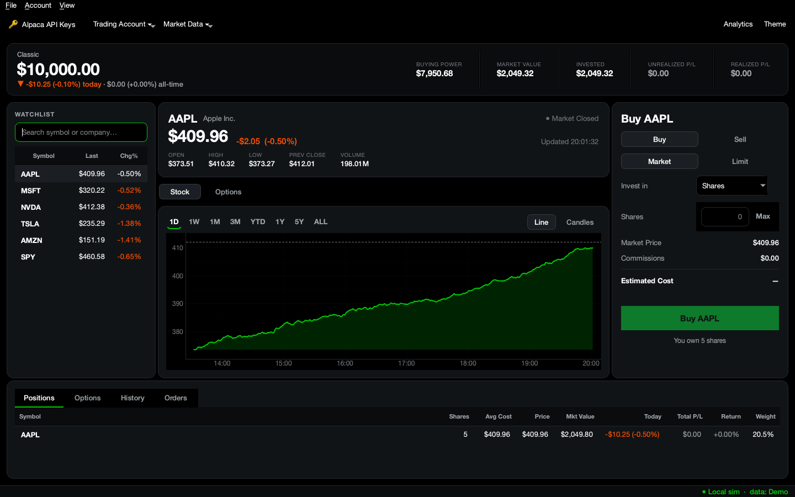

# Paper Trader

https://github.com/user-attachments/assets/cac3100f-b894-4394-aa11-1da3a4c711ad

A **paper-trading desktop app** with real-time market data, live Alpaca paper trading, and **options trading**. Features an animated, Robinhood-style GUI (rolling numbers, price flashes, chart draw-in), **Black-Scholes options** on the local simulator, **limit orders** with fractional shares, and live intraday/historical **line and candlestick charts** with interactive zoom. Run on your machine offline (demo mode) or connect to Alpaca (live paper account). Everything is in **pure black** or light themes, responsive, and never blocks on the network.

## Features

- **Live Alpaca paper trading** — real orders/positions/P&L to your paper account
- **Options trading** — Black-Scholes priced calls & puts, long & short, with Greeks
- **Animated UI** — rolling portfolio values, price flashes, chart draw-in, smooth fades
- **Charts** — line & candlestick with interactive zoom, scrubbing, crosshair, range picker (1D–ALL)
- **Data sources** — Alpaca (IEX), Yahoo Finance, or demo (offline, no network)
- **Extended hours** — pre-market & after-hours trading on Alpaca (limit orders only)
- **Sessions** — save/load named portfolios atomically; supports undo/reset
- **Analytics** — Sharpe ratio, volatility, max drawdown, win rate, equity curve
- **Rate limiting** — Alpaca ~200 calls/min with shared limiter across all requests
- **Responsive layout** — draggable splitters, narrow-screen column dropping
- **PyQt6 + pyqtgraph** — native GUI, dark & light themes, bundled Inter + Geist fonts

---


## Preview


<p align="center"><em>Options mode — a live Black-Scholes chain, the order ticket with Greeks, and open option positions:</em></p>


<p align="center"><em>The previous interface, still available with <code>run.py --old</code>:</em></p>



<p align="center"><em>Light mode with candles and the OHLC readout, and the offline demo mid-scrub — the price and change follow the crosshair:</em></p>

<p align="center">
  
  
</p>

---

## Quick start

Requires **Python 3.10+** (developed on 3.13).

```bash
cd paper_trader

# 1. Create an isolated environment
python3 -m venv .venv
source .venv/bin/activate          # Windows: .venv\Scripts\activate

# 2. Install dependencies
pip install -r requirements.txt

# 3. Run  (add --old for the previous interface)
python run.py                      # uses Alpaca if keys are set, else Yahoo
python run.py --demo               # fully offline: local simulator + synthetic data
```

### Connecting Alpaca (paper trading)

Get free **paper** API keys from [alpaca.markets](https://alpaca.markets) →
*Paper Trading* → *API Keys*, then either:

- launch the app and go to **Account → Alpaca API Keys…**, or
- set environment variables before launching:

  ```bash
  export APCA_API_KEY_ID=PK...
  export APCA_API_SECRET_KEY=...
  python run.py
  ```

Keys are stored locally at `~/.paper_trader/credentials.json` (chmod 600) — never
in the project. When keys are present the app defaults to your live Alpaca paper
account for trading **and** Alpaca (IEX) for market data. Switch backends anytime
from the **Account** and **View → Market Data Source** menus.

> No keys / offline / being rate-limited? `python run.py --demo` always works, or
> pick **View → Market Data Source → Demo** and **Account → Trading Account →
> Local simulator**.

### Run the tests

```bash
python tests/test_engine.py        # trading engine, portfolio, analytics, persistence
python tests/test_options.py       # Black-Scholes, options engine, chain, settlement
python tests/test_data.py          # data cache, synthetic provider, Yahoo parser
python tests/test_ui.py            # chart zoom, layout, empty states, theming (offscreen)
python tests/test_alpaca.py        # live Alpaca provider + broker (skips without keys)
```

---

## Using the app

**Top nav** — Search any symbol (`⌘F` / `Ctrl+F`), toggle the watchlist (left sidebar), switch **Account** (trading destination & API keys), **Market Data** source, **Theme**, or view **Analytics**. The status chip shows your active account + data source.

**Watchlist** (left) — Sparkline, price, and day's change per symbol. Click to chart; right-click to remove. Hides with the sidebar button.

**Chart** — Interactive **line** or **candlestick** view. Scroll to zoom the time axis (price axis refits automatically); hover for a **crosshair** and the hero's price **rolls** to match. The line view is bare by default; use **Theme → Chart** to show axes/gridlines. Previous close (dotted line) and OHLC readout (candles only).

**Order card** (right) — **Stock**: Buy/Sell tabs, market or limit, shares or dollars, estimated cost. **Options**: live bid/ask/mark, Greeks (Δ/θ/IV), collateral for shorts. One-click expand to the full **options chain** (expirations + strikes, auto-centered on the money).

**Bottom tabs** — **Positions** (holdings with P&L), **Options** (contracts, Greeks, DTE, one-click Close), **History** (all fills & exercises), **Orders** (resting limits, Cancel).

**File menu** — New, Open, Rename, Reset, or Save session.

**Menus**
- **Account** → trading account switch, Alpaca API keys, Analytics (Sharpe, volatility, max drawdown, equity curve)
- **Theme** → dark/light + chart furniture (axes, gridlines, animations)
- **View** → chart type, light/dark (`Ctrl+D`), data source

**Limit orders** wait for the market to cross your price, then fill at market on the next tick. Run silently in the background while you trade other symbols.

**Extended hours** (Alpaca) — Tick **Extended-hours order** on limit orders to trade pre-market (4:00–9:30 am) or after-hours (4:00–8:00 pm). Whole shares only; market orders and fractional not eligible. The header shows when a session is live.

**Options** (local simulator) — Black-Scholes priced off the live spot. Market orders fill at ask (long) / bid (short) for slippage. Shorts are cash-secured. Expired contracts auto-settle: long ITM exercised, short ITM assigned, OTM expires worthless.

**Legacy UI** — `python run.py --old` runs the previous interface. It shares the core engine, brokers, and data layer but has its own UI code.

**Config** — Sessions and settings live in `~/.paper_trader/` (override with `PAPER_TRADER_HOME=/dir python run.py`).

---

## Architecture

Four strict layers: **UI** (PyQt6) → **Broker** (LocalBroker / AlpacaBroker) → **Core** (pure logic) & **Data** (network only) → **Persistence**. The **core** imports neither Qt nor requests and is unit-tested headless. Data layer is the only network entry point with a shared rate limiter. Brokers abstract execution: both return identical DTOs so the UI doesn't care which is active. Network I/O runs on two background threads (market feed, broker poll) to keep the GUI responsive.

### Pluggable brokers & data sources

- **Trading** — *Alpaca paper* (live API calls to your paper account) or *Local simulator* (offline engine)
- **Market data** — *Alpaca (IEX)*, *Yahoo Finance*, or *Demo* (offline synthetic)
- **Rate limiting** — Alpaca's ~200 calls/min/account is managed by a shared sliding-window limiter across all requests. Load is reduced: multi-symbol snapshot batches, TTL cache, less-frequent fill polls. Steady-state: ~66 calls/min.

---

## Design notes

- **Money math** — all prices/quantities rounded via `util.round_money` (cents) / `round_shares` (1e-6). Dollar buys truncate shares down so orders can't exceed budget by a rounding cent.
- **Resilience** — network/HTTP failures, invalid tickers, missing keys, and offline states are caught and surfaced as toasts without crashing. Saves are atomic; corrupt session files are skipped.
- **Credentials** — Alpaca keys in `~/.paper_trader/credentials.json` (chmod 600) or `APCA_*` env vars, never in the repo. Load them at runtime into the process environment.
- **Threading** — market data and account poll run on background threads; all Qt updates queued to the GUI thread. Orders dispatched to a worker so the UI never blocks.

## Optional features implemented

Real Alpaca paper trading ✓ · **Extended-hours (pre/after-market) trading** ✓ ·
**Options trading (Black-Scholes, long & short)** ✓ ·
**Live options chain + Greeks** ✓ · **Animated UI (rolling numbers, price flash,
chart draw-in)** ✓ · Alpaca / Yahoo / synthetic data backends ✓ · Candlestick
charts ✓ · Limit orders ✓ · Analytics (Sharpe, volatility, drawdown, win rate) ✓ ·
Pure-black + light themes ✓ · Fractional shares ✓ · Buy in dollars or shares ✓ ·
Offline/demo mode ✓ · Rate-limit governor ✓

## Dependencies

`PyQt6` (GUI) · `pyqtgraph` (charts) · `requests` (Alpaca + Yahoo) · `numpy` (math).
Trading and market data via [Alpaca](https://alpaca.markets) (paper) and Yahoo
Finance, for personal, non-commercial use.
